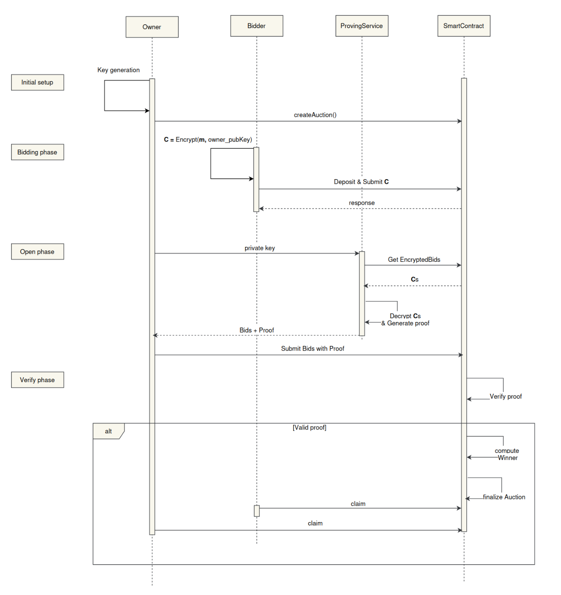

# SilentBid: On-Chain Sealed-Bid Auctions

## [Section 1] Project Information

- **Project Name:** SilentBid - On-chain Sealed-Bid Highest Auction
- **Payment Details:** 0x9efE53369D4894Ca22C63f489023B324C3D519BA (Polygon Network)
- **Total Amount Requested:** 6,500 USDC

## [Section 2] Project Overview :page_facing_up:

### Brief Description

**SilentBid** is an [**on-chain sealed-bid auction platform**](https://www.investopedia.com/terms/s/sealed-bid-auction.asp) developed
using the **Plonky3** toolkit. It enables secure, private auctions by leveraging **zero-knowledge proofs (ZKPs)** to determine the
highest bidder without disclosing individual bids. This ensures both privacy and fairness in the auction process.

SilentBid also serves as a **reference model** for developers building decentralized applications (dApps) with **Plonky3** and **ZKPs
**.

### Core Idea

1. **Bid Phase**: Bidders submit encrypted bids to a smart contract. Only the auction owner can decrypt these bids with their secret
   key.
2. **Open Phase**: The auction owner decrypts and publishes bid amounts alongside a ZK proof of the decryption process, including a
   hash of the inputs.
3. **Verification**: The smart contract verifies the ZK proof, computes, and publicly announces the winner.

#### Key Components

- **Proving Service**: Uses **Plonky3** to generate a zero-knowledge proof of bid decryption, preserving the confidentiality of the
  owner's private key.
- **Smart Contract**: Manages the auction lifecycle, including setup, bid collection, proof verification, and determining the winner.

### Technology Stack

- **Smart Contract**: Solidity
- **Circuit**: Rust, Plonky3
- **Encryption/Decryption**: RSA (32-bit)
- **Hash Function**: Rolling Hash

### Design Mockups/Prototypes (Optional)

The auction process is split into on-chain and off-chain phases:

1. **Setup Phase**: Auction owner initializes the auction, specifies deposit requirements, sets start and end times, and transfers
   assets to the contract.
2. **Bid Phase**: Bidders submit their encrypted bids and deposit the required amount.
3. **Open Phase**: Owner decrypts bids, generating a zero-knowledge proof.
4. **Verification Phase**: Owner submits the proof and decrypted bids to the contract, which verifies the winner.

#### Auction Flow

### Challenges

Current field constraints in Plonky3 are limited to `AbstractField` (64 bits, such as Goldilocks). We require 256-bit encryption, or
1024-bit RSA, for robust security, necessitating a breakdown of larger numbers into manageable parts—a complex process. Plonky3
supports only basic operations (addition, subtraction, multiplication), which limits its application in decryption phases.

To address this, we've opted for a simplified version using 32-bit RSA and a Rolling Hash. While simplified, this solution effectively
demonstrates Plonky3's strengths and limitations for future projects.

## [Section 3] Ecosystem Fit

### Similar Projects

Research on blockchain-based sealed-bid auctions includes:

- [Anonymous Fair Auction on Blockchain](https://ieeexplore.ieee.org/document/9432664)
- [Blockchain-Based Sealed-Bid e-Auction with Smart Contracts & ZKPs](https://www.researchgate.net/publication/351717293_A_Blockchain-Based_Sealed-Bid_e-Auction_Scheme_with_Smart_Contract_and_Zero-Knowledge_Proof)

These typically assume the verifier holds both private and public keys, which is impractical for smart contracts. Projects
like [AuctionContract](https://github.com/HSG88/AuctionContract) develop business logic within a smart contract but lack full security
and privacy solutions.

### Unique Contribution

SilentBid provides a **practical reference** for developers building **ZK-based dApps**, showcasing how **Plonky3** can address
real-world privacy needs.

## [Section 4] Team :busts_in_silhouette:

- **Team Members**: [SotaZK Labs](https://sotazk.org/) - focused on enhancing security and privacy through zero-knowledge solutions.
- **Number of Members**: 7
- **Contact Information**:
    - **Name**: Steve Nguyen
    - **Email**: zk.steve.nguyen@gmail.com
    - **Telegram**: @zk_steve
- **Prior Work/Research (Optional):**
    - [ZKP Documentation](https://github.com/sota-zk-labs/zkp-documents): Covers KZG, GKR, FRI, Plonk, Groth16, lattice-based
      commitments,
      and more.
    - [ZKP Implementation](https://github.com/sota-zk-labs/zkp-implementation): Includes protocols such as KZG, FRI, and Plonk.
    - [Apstark](https://github.com/sota-zk-labs/apstark): A Layer 2 ZK rollup on the Aptos network using Starknet.

## [Section 5] Development Roadmap :open_book:

> **Important:** The maximum project duration is 6 weeks. Milestones and timelines are outlined accordingly.

### Milestone 1 — Core Functionality

- **Duration**: 4 weeks
- **Scope**: Develop the core smart contract, auction functionality, and client-side proving service.
- **FTE (Full-Time Equivalent)**: 4
- **Budget**: 4,000 USDC

### Milestone 2 — Enhancements

- **Duration**: 2 weeks
- **Scope**: Code refinement, bug fixes, and developer documentation/tutorials.
- **FTE**: 4
- **Budget**: 2,500 USDC

### Total Costs: 6,500 USDC

## [Section 6] Extended Scope

### Future Plans

After this project, we plan to implement additional auction types, such as **Unique Lowest Bid** and **Dutch Auctions**. We also aim to
integrate with other **dApps** and explore partnerships with **DeFi platforms** to support automatic asset management post-auction.